# U.A High School 🏫
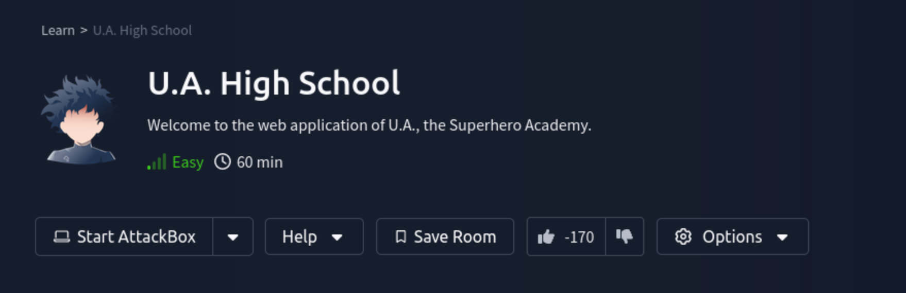

Hi, today we are gonna solve the U.A High School room on TryHackMe (easy difficulty). Even though the room was categorised as 'easy' I had quite some encounters with new material and techniques I did not know about.

### Enumeration
Firstly, lets start a `nmap` scan and look at the results:

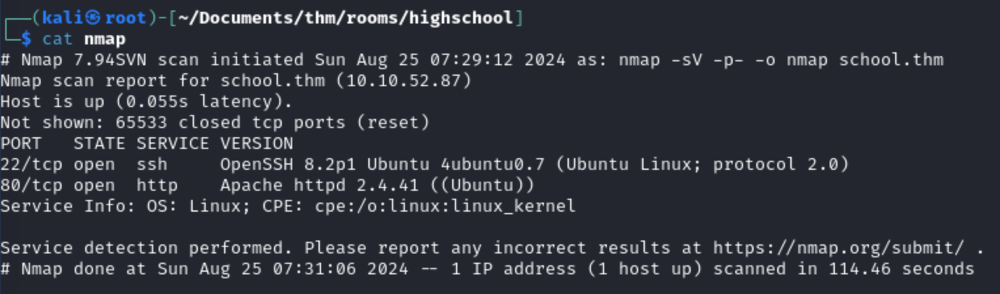

The scan shows that there are multiple services running. Lets first check out the website itself and start a `directory bruteforce` in the meanwhile using `feroxbuster`.

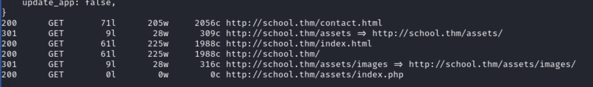

Now we know which directories exist and right of the bet we see something very unusual. There is a `index.php` file in the assets folder. Most of the time a assets folder holds only `CSS` and `JS` files, so this is quite out of the ordinary. Lets check it out. When opening this file we get a empty response. Usually PHP code does not show anything on the website, so this behaviour was quite normal, but I still thought it was a good idea to start fuzzing this file. 

I used `gobuster` in FUZZ mode and a wordlists containing all sorts of random words in combination with a generic PHP command.

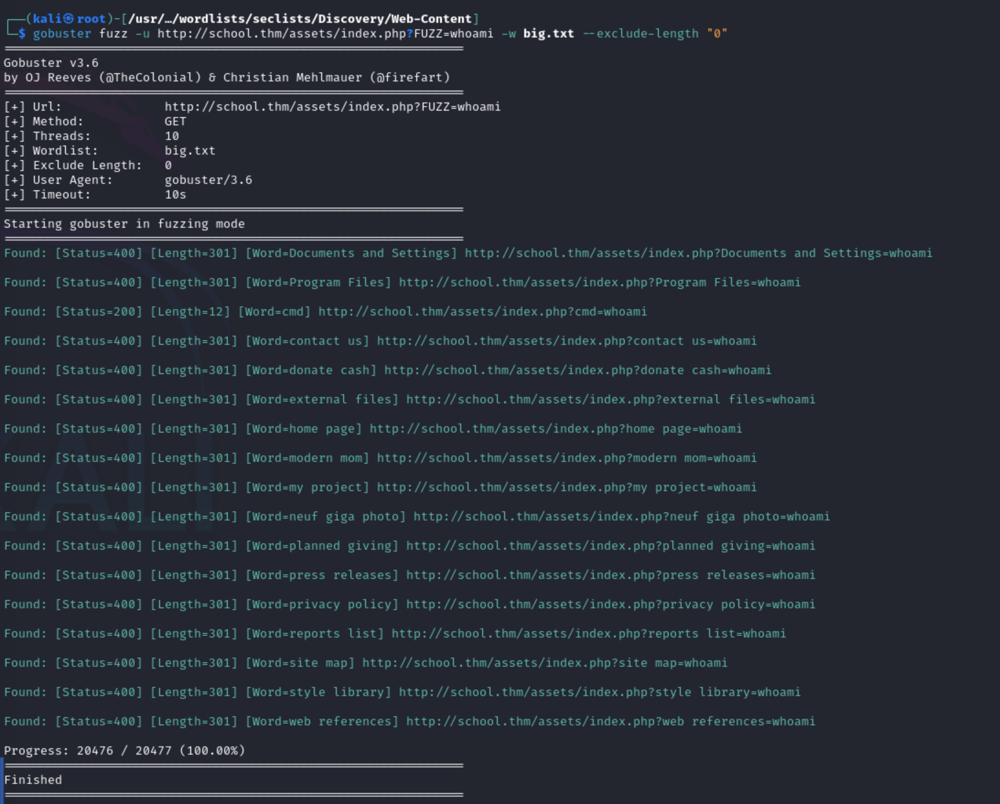

As you can see, there is definetly something going on with this file. I filtered out all of the responses that returned a 0 and we can see the we get a `200` on the `cmd` string. This means we have found an `command execution` vulnerability on this website. Lets dig a little deeper 🔭

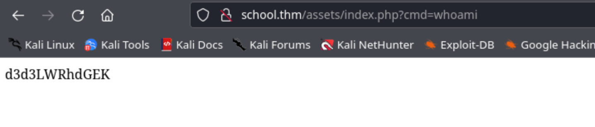

The body shows the return value of our `whoami` command which is `base64` encoded. When this value is decoded we can see the plain-text value of our command. In the meantime I tried to execute some different commands and look at the results.

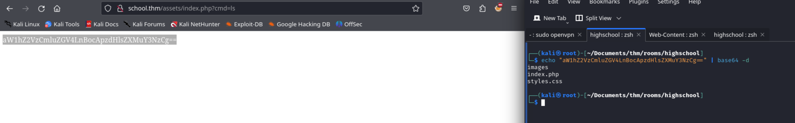

I used a online URL encoder to encode longer commands like `cat /etc/passwd`

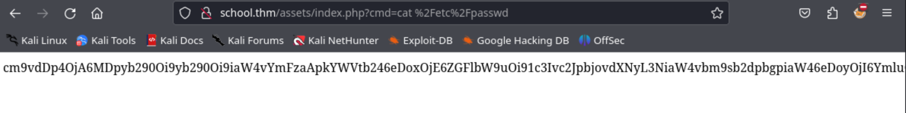
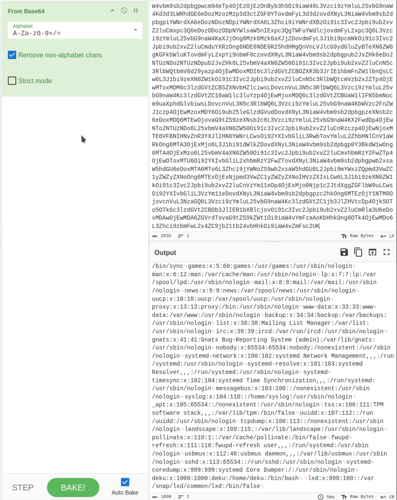

We have alot of access, so lets try to exploit this vulnerability and get out first reverse shell

### Reverse shell 🐚

To get our first reverse shell, Let's look up the PHP exploit code at [revshells.com](https://revshells.com) and make sure to use the `URL encoded` version.

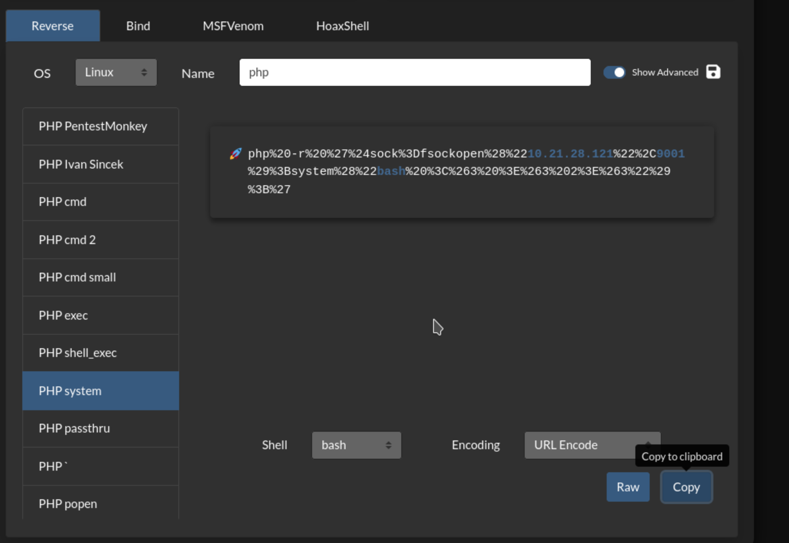

Before the execution of the code, make sure to start a listener on the desired port and execute the `PHP code` on the `index.php` file.

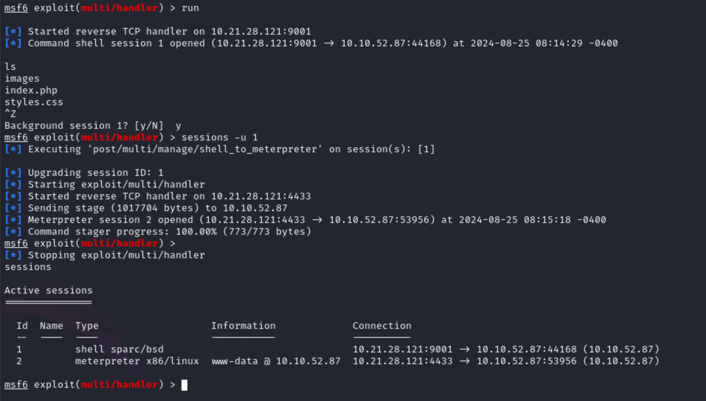

Quick tip: I like to use the `multi/handler` from metasploit as this can function as a 'dumb' shell, but has the functionality to get upgraded quite easily to a fully functional `meterpreter` session which can upload/download and do many more awesome things by default. After the upgrade to a `meterpreter` session, lets upload `linpeas` for some easy reconnaissance of the system. 

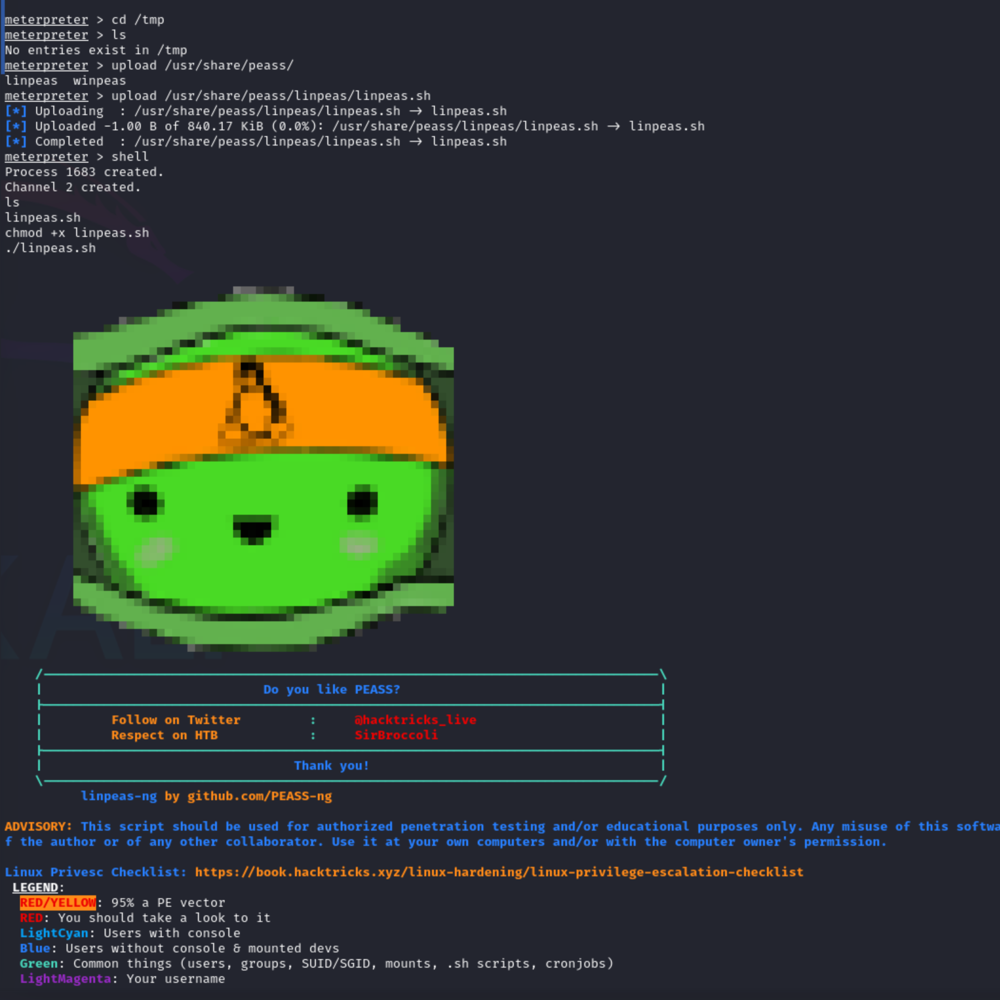

The output of `linpeas` gave some information on the system, but did not help escalate my privileges to the `deku` user. Lets search some more for clues or hidden files.

After some more searching I found a file called `passphrase.txt` in the `/var/www` directory. After readings its content we had a plain-text password.

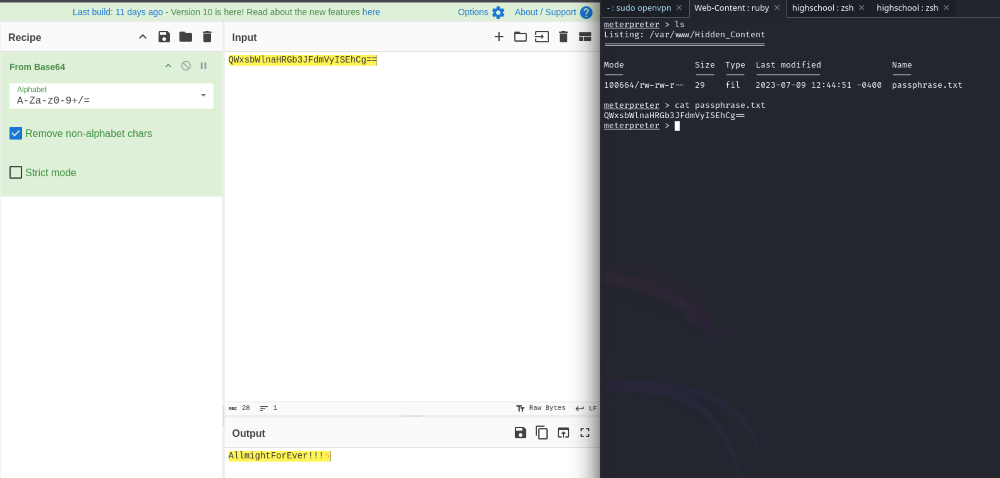

Sadly, this password was not the `ssh` password for the `deku` or `root` user so we have to dig deeper in the application. The `feroxbuster` output showed us that we have no permissions to open the images in the `/assets/images/` web-directory. That is kinda strange, so maybe there is something wrong with these images. Lets download them of the machine using `wget`.

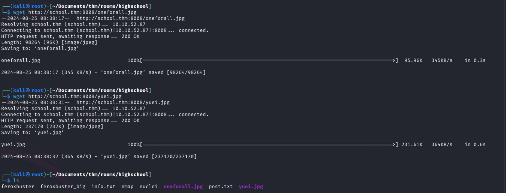

Right of the bet I noticed that one of the images was corrupted as seen in the screenshot below.

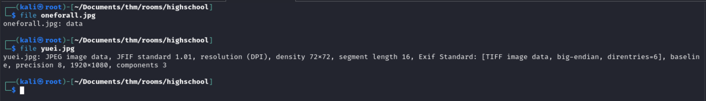

Both images are `JPG` files, but only one shows the right information on the `file` command. The `oneforall` file seems corrupted. I did not have alot of experience fixing image-files, so I decided to ask `ChatGPT` and google for some answers on what to look for to confirm that the file was corrupted. One site showed that is was possible for a image-file to have the wrong header and that could cause file corruption. Lets check it using `hexeditor`.

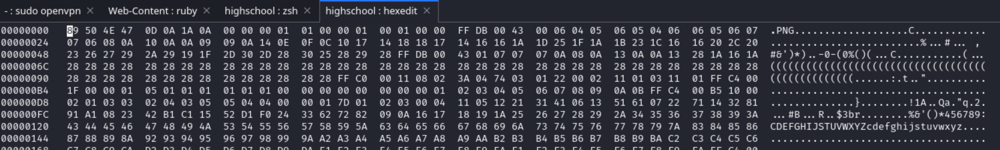

`hexeditor` showed us that the file had a `.png` header which caused the corruption, so we need to overwrite the bytes to set the right header and fix the file. `ChatGPT` showed me the right hexadecimal values for a `JPG` file.

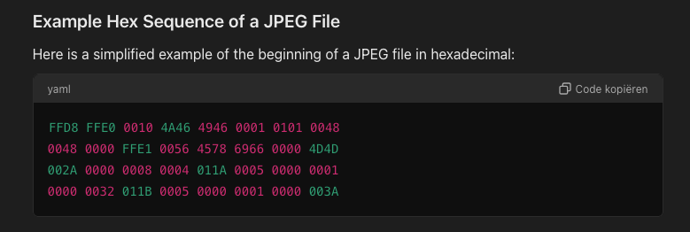
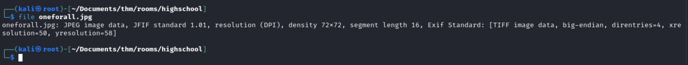

After overwriting the header with our answer from `ChatGPT`, I saved the file and checked it for hidden content using `steghide` using our recently found password.

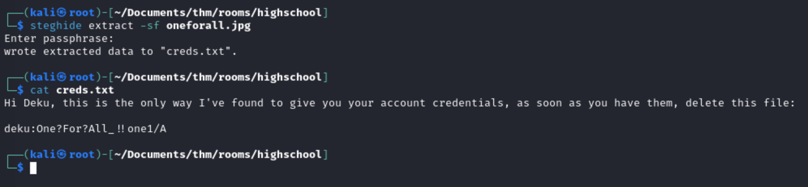

Cool! I think we found the password of the `deku` user. Lets try it out.

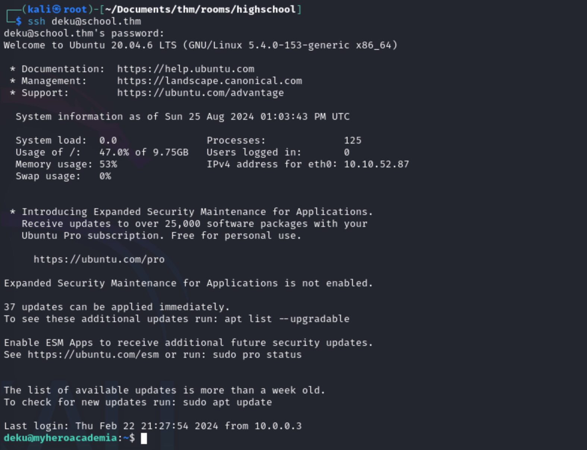

And we are in!! Lets get our first flag that is stored in the `deku` home folder 🚩and look for ways to escalate our current privileges to get to `root`. Upon executing the `sudo -ls` command, we can see that the `deku` user has `sudo` access to a executable program.

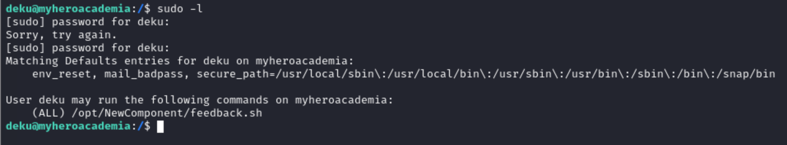

We can see that it is a bash file that we do not have write permissions for. The program asks for user input, but sadly, the user input gets filtered on most special characters. It looks like we cannot use this to execute another reverse shell, but we do have `sudo` permissions on this program. Lets try something out.

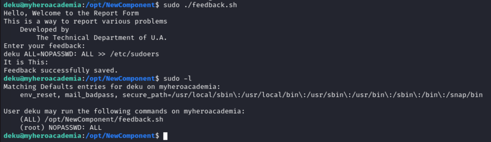

Haha! we successfully added the `deku` user to the `sudoers` group and we now have full `sudo` access on this machine. Lets capture the final flag! 🚩

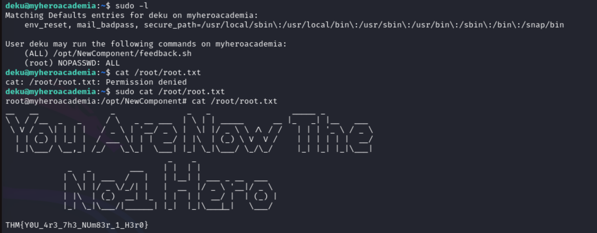

Yayy, Root access!! We successfully pwned this machine and completed the challenge 🥳
