# Bricks Heist
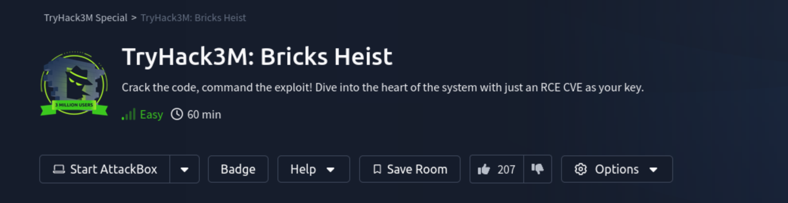

Howdy, today we are gonna solve the Bricks Heist challenge (easy difficulty) 💯

### Enumeration
Firstly, lets start a `nmap` scan and look at the results:

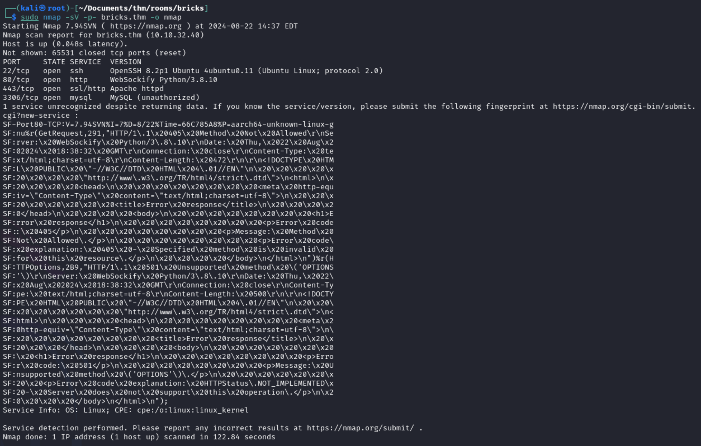

The scan shows that there are multiple services running. Lets first check out the website itself and start a `directory bruteforce` in the meanwhile.

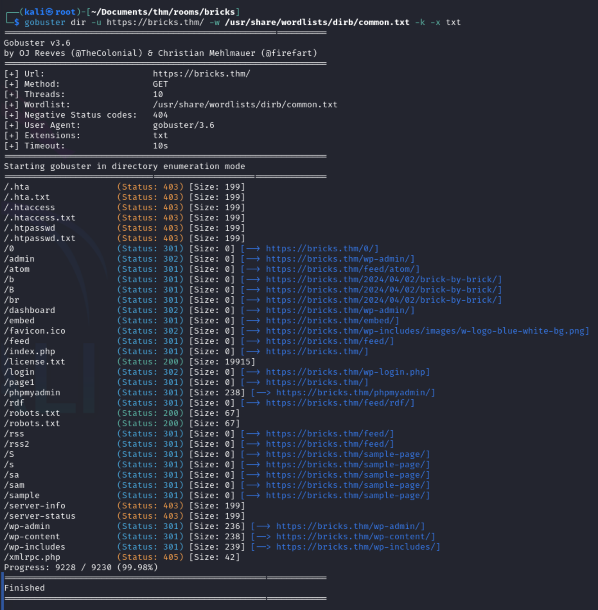

Now we know which directories exist and that we are up against a `wordpress` website. There is this really great tool called `wpscan` which can enumerate a wordpress website with great detail.
Let's fire it up and look at the results for further enumeration.

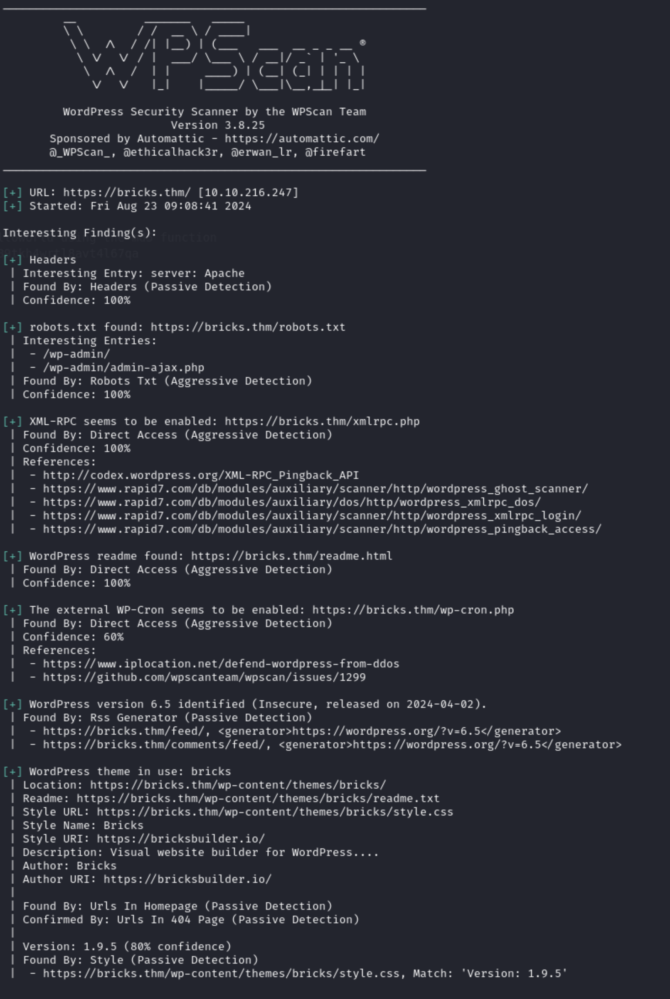

Great! We now have a `wordpress` version and a `Bricks theme` version. Lets check the internet for any existing vulnerabilites. If you look up the `Bricks` theme version you will find out that it is vulnerable and that there is a `RCE PoC` on Github which we can make use of. Lets download the python script, create a new virtual environment, install all dependencies needed and execute it.

### Our first shell 🐚

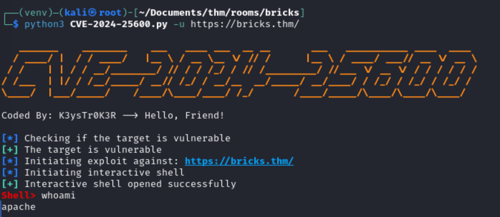

As you can see in the screenshot above, the exploit worked and we have `Remote Command Execution`. To answer the first question of the challenge execute `ls` in the folder we are in we can see a weird text file. If we `cat` that file we have our answer 🚩

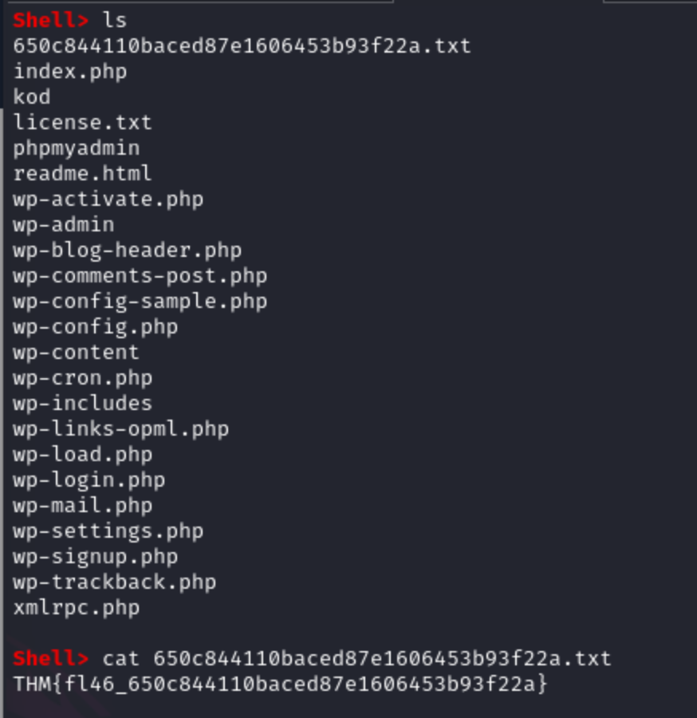

## Looking for answers 🔍

That went great! Now lets look for the other answers. The second question wants the name of a suspicious process. I tried to find this process with `ps aux` but I did not find it this way. After searching the internet I came across the following solution.

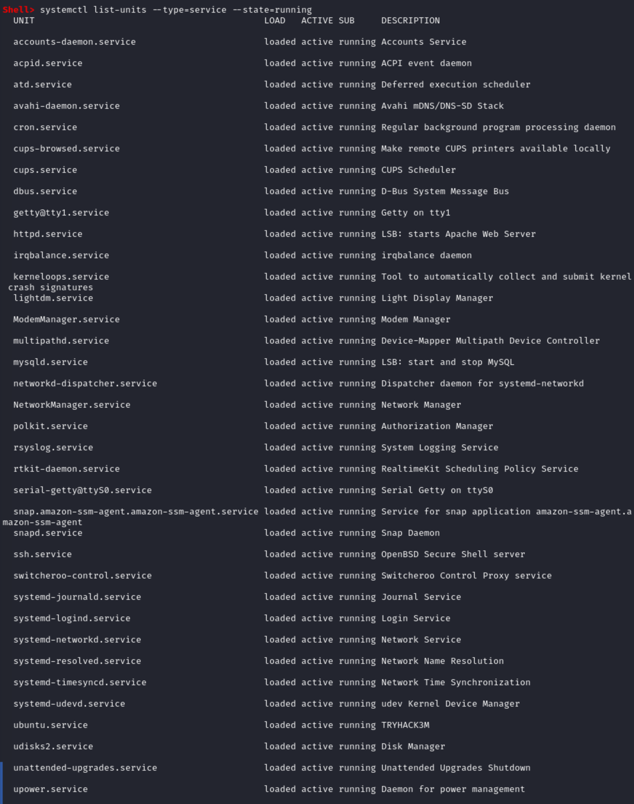

The above image shows clearly that there is a weird service running called `ubuntu.service`, which is the answer to our third question 🚩. To further check that service, lets look at its configuration in `/etc/systemd/system/ubuntu.service`

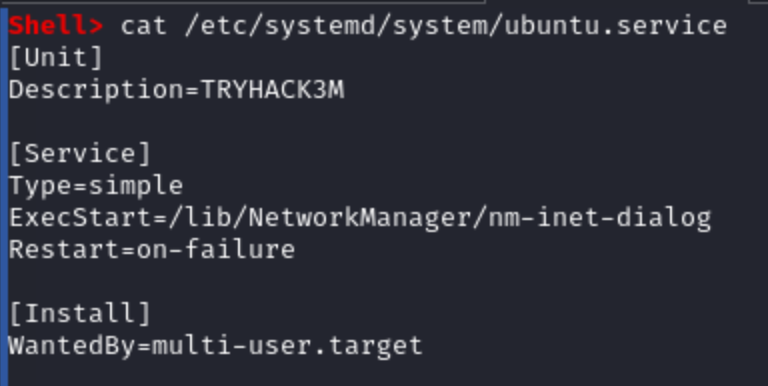

Aha, this service runs a binary called `nm-inet-dialog` in the `/lib/NetworkManager/` folder. The name of this binary is the answer to the second question 🚩

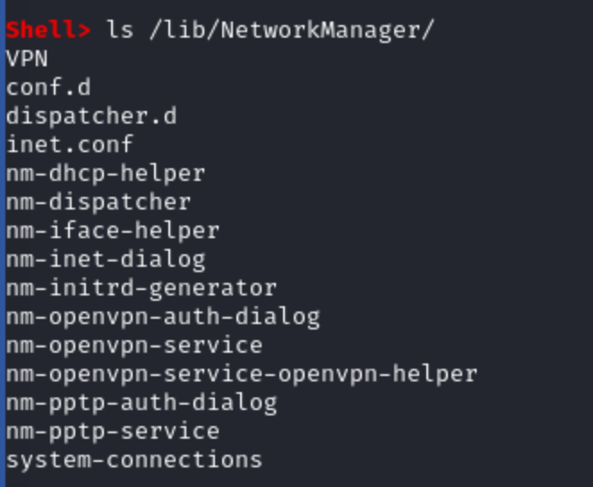

For the fourth question of the challenge we need to identify the log file of this binary. After a quick check of all the files, I found out that the log file is called `inet.conf` 🚩
Before we continue, I found it really annoying that the shell we have is a bit unstable. I decided to upload my own shell and execute it. This way I would make my life a little bit easier.

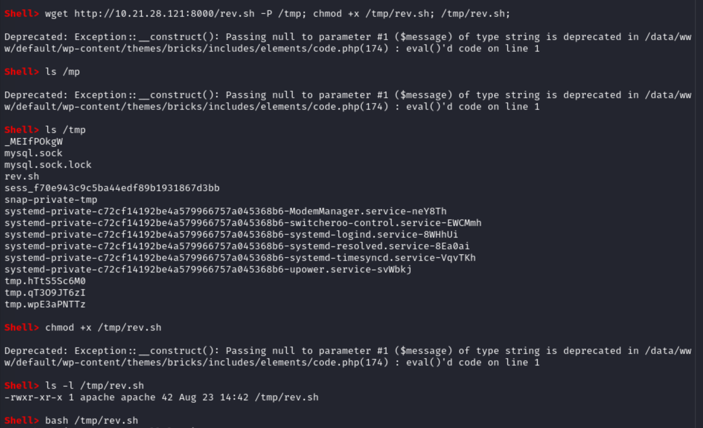

Lets continue where we left off. We identified the malicious service, in what directory this binary exists and we found the log file of the binary. For question number five, we are asked to find the wallet address of the miner instance. I tried the `strings` command on the `nm-inet-dialog` binary to maybe find a hardcoded wallet address, but sadly this was not the case. I also noticed that we could not see the whole log file, due to it being to big. Instead of reading the content of the `inet.conf` file using `cat`, I tried using `head`.

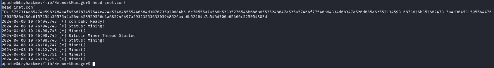

We are shown a `ID` value which looks kinda off. Lets check it on `cyberchef`. One of the cool features of `cyberchef` is its magic tool. This tool can automatically decode strings. When I put the `ID` value string in `cyberchef` and clicked on the magic tool button, we got something that looks like a BTC wallet address.

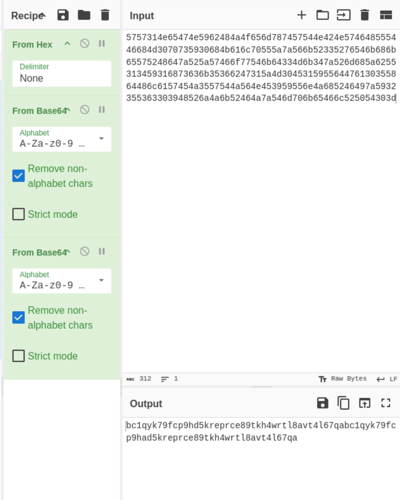

Strangely the wallet address is too long. After some tinkering I found out that it was the same wallet address twice in one string.

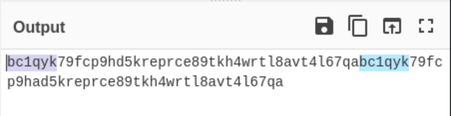

I copied the address and dropped it into a online BTC wallet address checker, which showed that we had a valid address!! 🥳
The plain-text wallet address is the answer to the fifth question 🚩

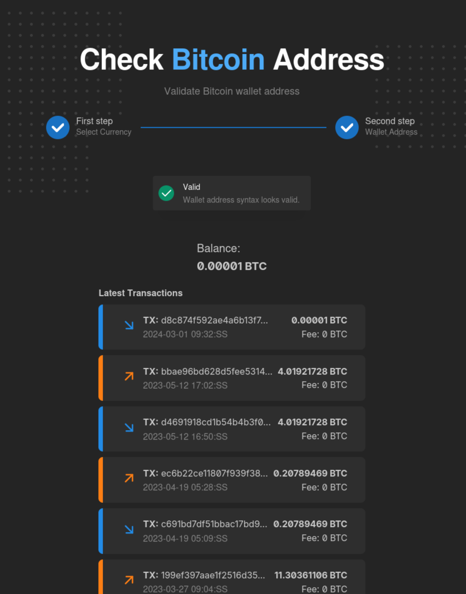

For the last and final question, we are asked to identify the `threat group` that used this wallet. If you google the wallet address you will see fairly quickly to which group this wallet belongs.
And with that this challenge is solved 🍾🍾

